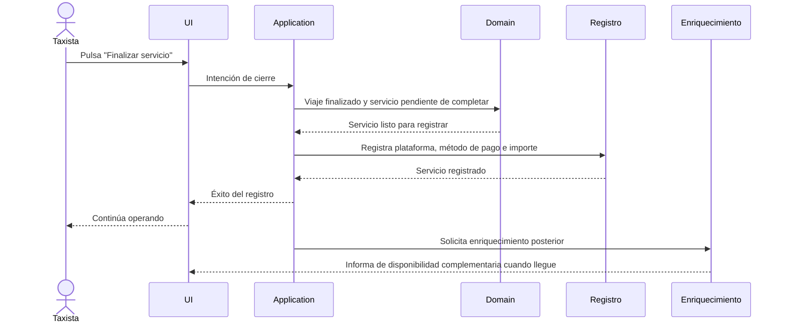

# Critical Path Migration Plan v1.0

## 0. Propósito

Este documento define el plan arquitectónico de migración para separar de forma estricta:

- el camino crítico del registro del servicio;
- el camino de enriquecimiento del servicio.

El objetivo no es mejorar la latencia.

El objetivo es hacer que la arquitectura represente correctamente la realidad operativa del taxista:

primero existe el hecho económico;
después se añaden los datos accesorios.

Este documento no propone implementación.

No propone optimización técnica.

No modifica documentación existente.

Su función es definir la arquitectura objetivo y el orden correcto de migración hacia ella.

---

## 1. Principio rector

Este plan parte de un principio ya aprobado:

> El hecho económico tiene prioridad absoluta. Todo enriquecimiento debe quedar fuera del camino crítico del registro del servicio.

GeoTaxi registra primero la realidad económica del trabajo del taxista. Todo lo demás constituye enriquecimiento del registro.

Consecuencias obligatorias:

- ningún dato accesorio puede bloquear el registro;
- ningún dato accesorio puede definir la existencia del servicio;
- ningún dato accesorio puede condicionar la validez del hecho económico;
- el enriquecimiento puede fallar sin invalidar el registro;
- el enriquecimiento puede llegar después del registro.
- el enriquecimiento debe ser recuperable si no puede completarse en el primer intento.

---

## 2. Modelo arquitectónico objetivo

El modelo correcto no debe pensar el flujo como una pantalla que espera a completar un formulario.

Debe pensar el flujo como dos hechos distintos:

1. el viaje finaliza como hecho operativo;
2. el servicio queda pendiente de completar con los datos económicos esenciales;
3. el taxista registra plataforma, método de pago e importe;
4. el servicio queda registrado;
5. el registro puede seguir enriqueciéndose con información auxiliar.

### 2.1. Entidades semánticas implicadas

#### Servicio

Representa el hecho económico registrado.

Es el núcleo crítico del negocio.

Su existencia depende de información esencial:

- identidad;
- cronología necesaria para ubicar el hecho;
- clasificación operativa mínima;
- importe;
- método de pago;
- asociación al contexto operativo cuando corresponda.

#### Viaje

Representa el hecho operativo del desplazamiento o de la prestación conservada como memoria operativa.

Puede preceder, coexistir o servir de soporte contextual al Servicio.

No debe absorber datos que solo pertenecen al enriquecimiento.

#### Servicio pendiente de completar

Representa el intervalo entre el final del viaje y el registro económico completo del servicio.

Es un estado operativo del flujo, no una alteración del hecho económico.

Permite expresar que el viaje ya terminó, pero el servicio todavía no ha quedado documentado con sus datos esenciales.

#### Enriquecimiento del Servicio

Representa información complementaria que mejora lectura, análisis, localización o explotación futura del registro.

No define la existencia del Servicio.

No participa en la validez del registro.

---

## 3. Camino crítico objetivo

El camino crítico es la secuencia mínima que debe completarse para que el Servicio quede registrado.

Debe reflejar esta secuencia:

Viaje activo
↓
Viaje finalizado
↓
Servicio pendiente de completar
↓
Registro de plataforma, método de pago e importe
↓
Servicio registrado
↓
Enriquecimiento

No incluye geolocalización.

No incluye geocodificación.

No incluye snapshot.

No incluye resúmenes.

No incluye métricas.

No incluye refresco global de pantalla.

### 3.1. Secuencia funcional deseada

1. El taxista pulsa `Finalizar servicio`.
2. El viaje activo pasa a viaje finalizado.
3. El servicio queda pendiente de completar.
4. El taxista registra la plataforma, el método de pago y el importe.
5. El Servicio queda registrado.
6. La UI recupera inmediatamente el control operativo.
7. El enriquecimiento, si existe, queda desacoplado del registro.

### 3.2. Qué significa "registrado"

Un Servicio está registrado cuando el sistema ha conservado de forma estable el hecho económico mínimo ya completado con plataforma, método de pago e importe.

Eso implica:

- que el registro existe de forma estable;
- que el sistema puede reconstruirlo;
- que el usuario puede continuar trabajando;
- que ningún enriquecimiento pendiente invalida el hecho.

### 3.3. Qué no forma parte del camino crítico

No forman parte del camino crítico:

- obtención de GPS;
- resolución de barrio, distrito o dirección;
- construcción de snapshot GEO;
- cálculo de resúmenes;
- recomposición de proyecciones de lectura;
- refresco de métricas;
- validaciones que solo afectan a lectura, análisis o presentación;
- cualquier operación que pueda ejecutarse después sin alterar la verdad del hecho.

### 3.4. Resultado arquitectónico esperado

El camino crítico debe terminar tan pronto como el Servicio exista como hecho económico.

Todo lo demás debe convertirse en enriquecimiento posterior.

---

## 4. Camino de enriquecimiento objetivo

El camino de enriquecimiento agrupa todo lo que añade valor, pero no define el registro.

### 4.1. Operaciones que pertenecen al enriquecimiento

- geolocalización;
- geocodificación administrativa;
- snapshot geográfico;
- resolución de barrio;
- resolución de distrito;
- resolución de zona especial;
- resúmenes diarios, semanales o mensuales;
- estadísticas;
- agregaciones;
- proyecciones para UI;
- cualquier derivado calculado a partir del registro crítico;
- cualquier metadato auxiliar no imprescindible para la validez del Servicio.

### 4.2. Cuándo deben ejecutarse

El enriquecimiento debe ejecutarse después de que el Servicio haya quedado registrado.

Si puede iniciarse sin bloquear el registro, mejor.

Si no puede iniciarse inmediatamente, debe quedar diferido.

El registro nunca puede esperar al enriquecimiento.

### 4.3. Qué puede ejecutarse en paralelo

Pueden ejecutarse en paralelo, una vez registrado el Servicio:

- captura de ubicación;
- resolución administrativa;
- generación de snapshot;
- refresco de resúmenes;
- recalculo de proyecciones de lectura;
- actualización de vistas derivadas.

La paralelización es una consecuencia posible.

No es la base del diseño.

### 4.4. Qué puede ejecutarse después

Puede ejecutarse diferido:

- cualquier enriquecimiento espacial;
- cualquier enriquecimiento analítico;
- cualquier proyección de pantalla;
- cualquier sincronización de información complementaria;
- cualquier tarea que solo mejore la lectura posterior.

### 4.5. Qué debe ser tolerante a fallo

Todo el camino de enriquecimiento debe ser tolerante a fallo.

Si falla:

- el Servicio sigue siendo válido;
- el hecho económico previamente registrado no se altera;
- la UI no debe quedar bloqueada;
- el sistema puede reintentar o registrar el fallo para posterior recuperación.

### 4.6. Principio de recuperación del enriquecimiento

El enriquecimiento debe ser recuperable.

Si una operación de enriquecimiento falla:

- el Servicio continúa siendo válido;
- la operación puede volver a intentarse posteriormente;
- el enriquecimiento nunca modifica el hecho económico previamente registrado.

Este principio protege la separación entre verdad del negocio y completitud auxiliar.

---

## 5. Necesidad de nuevos eventos y estados

### 5.1. Nuevos eventos

Sí es recomendable introducir eventos explícitos si ayudan a separar semánticamente el registro del enriquecimiento.

El evento más importante del nuevo modelo es el que expresa que el hecho económico quedó registrado.

Propuesta conceptual:

- `ServiceRegistered`

Ese evento no describe un enriquecimiento.

Describe un hecho económico consolidado.

Además, pueden existir eventos secundarios para enriquecer o completar información, por ejemplo:

- `ServiceEnrichmentRequested`;
- `ServiceGeoSnapshotCaptured`;
- `ServiceEnrichmentCompleted`;
- `ServiceEnrichmentFailed`.

Estos eventos solo deben existir si aportan claridad real.

### 5.2. Nuevos estados

No es necesario introducir estados de enriquecimiento dentro del núcleo del Servicio si eso convierte el enriquecimiento en semántica primaria.

El núcleo debe poder expresar con claridad:

- registrado;
- no registrado.

La condición de enriquecido o no enriquecido no debe convertirse en un estado de negocio obligatorio del servicio.

Si se necesita visibilidad operativa sobre el enriquecimiento, esa condición puede vivir:

- en una proyección;
- en un modelo de lectura;
- en un mecanismo de tareas diferidas;
- o en un estado de proceso, no de dominio.

### 5.3. Decisión arquitectónica recomendada

Introducir eventos nuevos, sí, si clarifican el paso entre registro y enriquecimiento.

Introducir estados nuevos en el dominio solo si son semánticamente inevitables.

La recomendación es mantener el dominio pequeño y usar eventos para reflejar la transición, no para inflar estados.

---

## 6. Impacto por capa

### 6.1. Domain

Impacto esperado:

- separar con mayor nitidez el hecho económico del enriquecimiento;
- evitar que geografía, estadísticas o snapshots formen parte del núcleo semántico;
- formalizar el Servicio como hecho económico primario;
- mantener la lógica de validez libre de dependencias accesorias.

Posible simplificación:

- reducir el papel de estados derivados en el dominio;
- evitar que el enriquecimiento se lea como parte de la definición del servicio.

### 6.2. Application

Impacto esperado:

- el caso de uso de cierre debe terminar cuando el Servicio quede registrado;
- el enriquecimiento debe orquestarse como paso posterior;
- la UI no debe esperar a tareas accesorias para continuar;
- los casos de uso deben dejar de mezclar intención de registro con tareas de lectura.

### 6.3. Infrastructure

Impacto esperado:

- separación clara entre registro crítico y tareas de enriquecimiento;
- ejecución diferida o en segundo plano para enriquecimientos;
- posibilidad de reintentos sin afectar el core;
- adaptación de servicios técnicos de geolocalización y resolver a un plano no bloqueante.

### 6.4. Persistence

Impacto esperado:

- el registro crítico debe conservarse como una unidad estable;
- el enriquecimiento debe conservarse aparte;
- no debe exigirse que los datos accesorios existan para que el registro sea válido;
- las estructuras derivadas no deben condicionar la validez del core.

### 6.5. UI

Impacto esperado:

- la interfaz debe liberar el flujo tan pronto como el Servicio quede registrado;
- el Bottom Sheet no debe esperar a enriquecer;
- la UI puede reflejar enriquecimiento posterior como información secundaria;
- el usuario no debe percibir que el sistema "sigue pensando" para dejarle continuar.

### 6.6. Eventos

Impacto esperado:

- el evento crítico debe emitirse en el momento del registro;
- los eventos de enriquecimiento deben ser posteriores;
- la semántica del evento principal no debe depender de tareas accesorias;
- el orden temporal debe reflejar mejor el trabajo real.

### 6.7. Casos de uso

Impacto esperado:

- separar intención de registrar del servicio y obtención de enriquecimiento;
- reducir el acoplamiento entre finalización y lectura derivada;
- permitir que los casos de uso críticos sean simples y previsibles.

### 6.8. Repositorios

Impacto esperado:

- un repositorio para el hecho crítico;
- repositorios o adaptadores separados para enriquecimiento;
- evitar repositorios híbridos que mezclen verdad primaria con datos accesorios.

---

## 7. Estrategia de migración

La migración debe ser progresiva.

No debe ser un big bang.

Cada fase debe poder implementarse y validarse de forma independiente.

### Fase 1. Fijar el corte semántico

Objetivo:

definir de forma estable qué pertenece al camino crítico y qué pertenece al enriquecimiento.

Resultado esperado:

- el equipo y la arquitectura comparten la misma frontera;
- los datos críticos quedan identificados sin ambigüedad;
- los datos accesorios quedan clasificados fuera del registro.

Validación independiente:

- revisión arquitectónica;
- revisión de casos de uso;
- revisión de contratos entre capas.

### Fase 2. Separar el registro crítico del enriquecimiento

Objetivo:

hacer que el Servicio pueda registrarse sin depender del enriquecimiento.

Resultado esperado:

- el Servicio queda registrado al terminar el camino crítico;
- cualquier enriquecimiento se ejecuta después;
- el fallo del enriquecimiento no invalida el registro.

Validación independiente:

- el servicio sigue registrándose aunque falle GPS;
- el servicio sigue registrándose aunque falle snapshot;
- el servicio sigue registrándose aunque falle el refresco derivado.

### Fase 3. Formalizar los eventos y contratos de salida

Objetivo:

introducir contratos explícitos para el hecho crítico y para el enriquecimiento posterior.

Resultado esperado:

- el sistema puede distinguir registro de servicio y enriquecimiento;
- los consumidores de eventos no confunden ambos hechos;
- la UI recibe una señal clara de éxito crítico.

Validación independiente:

- el evento del registro puede consumirse sin esperar enriquecimiento;
- el enriquecimiento puede fallar sin afectar al evento crítico.

### Fase 4. Extraer el camino de enriquecimiento

Objetivo:

convertir el enriquecimiento en un flujo propio, no bloqueante y tolerante a fallo.

Resultado esperado:

- geolocalización y snapshot quedan fuera del camino crítico;
- los resúmenes dejan de formar parte del cierre operativo;
- las tareas accesorias pueden reintentarse o posponerse.

Validación independiente:

- el registro crítico finaliza antes de que el enriquecimiento termine;
- el enriquecimiento puede ejecutarse tardíamente;
- el enriquecimiento no bloquea la navegación ni la interacción.

### Fase 5. Normalizar el modelo de lectura

Objetivo:

alinear UI, proyecciones y resúmenes con el nuevo modelo semántico.

Resultado esperado:

- las vistas muestran información enriquecida como derivada;
- los listados no dependen de enriquecer para ser utilizables;
- los refrescos se comportan como lectura, no como parte del registro.

Validación independiente:

- la pantalla es utilizable con datos críticos;
- las métricas se actualizan sin bloquear la operativa;
- el resultado visible es coherente con el nuevo modelo.

### Fase 6. Limpieza del legado semántico

Objetivo:

eliminar la mezcla residual entre registro y enriquecimiento.

Resultado esperado:

- no quedan rutas críticas dependientes de datos accesorios;
- no quedan nombres o estados que sugieran una dependencia falsa;
- el modelo queda estable y coherente.

Validación independiente:

- no existe duplicación de responsabilidades;
- no existe bloqueo funcional por enriquecimiento;
- la arquitectura refleja el dominio y no la historia accidental del código.

---

## 8. Riesgos

| Riesgo | Gravedad | Probabilidad | Mitigación |
|---|---:|---:|---|
| Separar el enriquecimiento revela dependencias ocultas en UI o presentación | Alta | Alta | Migrar en fases y validar cada punto de acoplamiento con pruebas de caracterización |
| El modelo de dominio actual no expresa con suficiente claridad el hecho económico independiente | Alta | Media | Reforzar los contratos semánticos antes de mover la implementación |
| Los consumidores actuales interpretan el enriquecimiento como parte de la validez | Alta | Alta | Introducir eventos/estados explícitos y mantener compatibilidad de lectura durante la transición |
| Persistencia híbrida entre crítico y accesorio provoca incoherencias temporales | Alta | Media | Separar escrituras y definir una fuente de verdad primaria por fase |
| El refresco de UI sigue actuando como dependencia oculta del registro | Media | Alta | Aislar el refresco como lectura posterior y no como condición de éxito |
| El equipo confunde separación semántica con optimización técnica | Media | Media | Documentar que el objetivo es fidelidad del dominio, no solo rendimiento |
| Reintentos de enriquecimiento generan duplicados o estados ambiguos | Media | Media | Hacer que las tareas accesorias sean idempotentes y observables |
| Se introduce complejidad excesiva al intentar capturar todo el proceso con nuevos estados | Media | Media | Mantener el dominio pequeño y preferir eventos y contratos simples |

---

## 9. Oportunidades adicionales

La separación entre camino crítico y enriquecimiento abre varias simplificaciones arquitectónicas:

### 9.1. Simplificación del modelo de validez

La validez del servicio puede depender solo del hecho económico.

Eso reduce ambigüedad y evita estados que mezclen verdad operativa con completitud administrativa.

### 9.2. Simplificación de la UI

La UI deja de esperar operaciones accesorias para continuar.

Eso permite una interacción más fiel al trabajo del taxista y menos sensible a la variabilidad técnica.

### 9.3. Simplificación de los casos de uso

Los casos de uso dejan de cargar con responsabilidades que no les pertenecen.

Resultado:

- menos coordinación accidental;
- menos condicionales de fallback;
- menos lógica híbrida.

### 9.4. Simplificación de la persistencia

El almacenamiento crítico puede quedar más claro si el enriquecimiento se trata como información secundaria.

Eso mejora la trazabilidad del hecho y reduce el riesgo de mezclar verdad primaria con datos derivados.

### 9.5. Simplificación del lenguaje del dominio

El lenguaje puede volverse más preciso si:

- Servicio significa hecho económico registrado;
- Viaje significa hecho operativo;
- Enriquecimiento significa información complementaria.

Esa claridad reduce fricción entre documentos, código y experiencia de uso.

### 9.6. Simplificación de la observabilidad

Separar ambos caminos permite medir mejor:

- cuánto tarda el registro crítico;
- cuánto tarda el enriquecimiento;
- dónde fallan las tareas accesorias;
- qué parte del sistema afecta realmente al trabajo del taxista.

---

## 10. Diseño del flujo objetivo

Este diagrama representa la intención arquitectónica.

No describe una implementación concreta.

---

## 11. Criterio de éxito

La migración será correcta si se cumplen todas estas condiciones:

- el registro del servicio se confirma sin esperar enriquecimiento;
- el enriquecimiento no bloquea la operativa;
- el dominio expresa con claridad qué es el hecho crítico;
- la UI deja de depender de datos accesorios para continuar;
- la persistencia separa la verdad primaria de los derivados;
- los eventos reflejan el orden real del negocio;
- los repositorios ya no mezclan responsabilidades.

---

## 12. Conclusión

La arquitectura correcta no es la que captura todo antes de avanzar.

La arquitectura correcta es la que protege primero la verdad económica del servicio y deja el enriquecimiento en un segundo plano semántico.

Por tanto:

- el camino crítico debe ser mínimo, estable y suficiente;
- el enriquecimiento debe ser posterior, opcional y tolerante a fallo;
- la migración debe realizarse por fases;
- cualquier cambio de implementación posterior debe subordinarse a esta frontera arquitectónica.

---

## 13. Documentos de referencia

- `docs/architecture/Critical vs Enrichment Domain Data Review v1.0.md`
- `docs/architecture/Prioridad Operativa y Enriquecimiento de Datos v1.0.md`
- `docs/architecture/GeoTaxi Operational Event Model v1.0.md`
- `docs/architecture/Domain Layer v1.0.md`
- `docs/domain/Trip Domain v2.md`
- `docs/persistence/Persistent Model v1.0.md`
